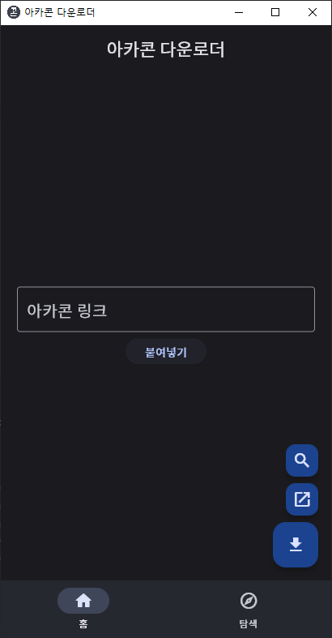

<!--    -->
  <h2>아카콘 다운로더</h2>

Flutter로 제작한 아카라이브 이모티콘 '아카콘' 다운로더 

일반적인 이미지 파일 형식 `.png .jpg .gif`은 그냥 다운로드하면 되지만, `.mp4` 형식의 움직이는 아카콘은 그렇지 않습니다. 
'아카콘 다운로더'는 ffmpeg를 통해 `.mp4` 파일을 `.gif` 형식으로 변환하여 디스크에 저장합니다. 

여러 아카콘을 한꺼번에 다운로드하고 싶을 때, '아카콘 다운로더'는 웹 크롤링으로 아카콘을 모아서 다운로드할 수 있습니다.

## 설치
[Windows](https://github.com/ppaka/arcacon_downloader/releases/latest/download/Windows.zip) | Android 7.0+ ([apk](https://github.com/ppaka/arcacon_downloader/releases/latest/download/app-release.apk), [~~Play Store~~](https://play.google.com/store/apps/details?id=com.ppaka.ArcaconDownloader)) |
| ------------- | ------------- | 

Windows 버전의 경우, Python 3 (3.10 이상 권장) 설치를 필요로 합니다.  
~~Android apk 버전과 Play Store 버전에는 차이가 있습니다. ~~
~~apk 버전에는 앱 내에서 빠르게 검색할 수 있는 기능- 탐색 페이지가 존재하지만, ~~
~~Play Store 버전에는 <b>심의 문제로 인해 탐색 페이지가 제공되지 않습니다.</b> ~~
Play Store 버전은 현재 유지보수되고 있지 않습니다.
